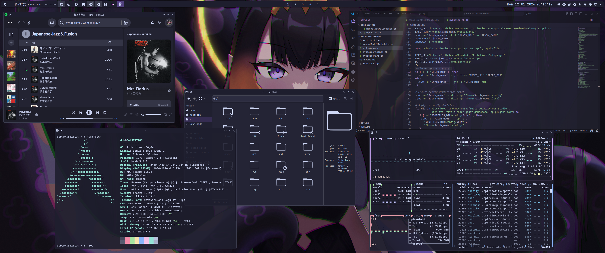
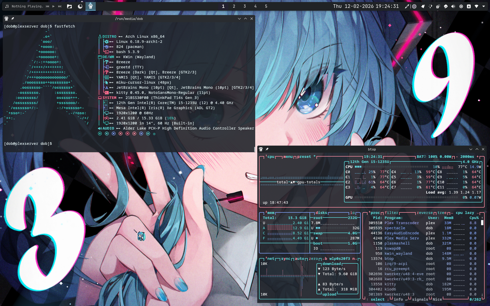

<h1 align="center">FrosteArch</h1>

<p align="center"><strong>Official Installation Media and Provisioning Toolkit</strong></p>

FrosteArch is a curated Arch Linux setup designed to deliver a consistent, opinionated experience across desktop and server deployments.

It currently ships in two editions:

- Desktop Edition
- Server Edition

FrosteArch Desktop includes a complete daily-driver environment with programming, productivity, gaming, and creative tooling.

FrosteArch Server is a streamlined profile optimized for long-running services, including Plex defaults and practical on-device debugging tools.

---

<h2 align="center">FrosteArch Desktop</h2>

<p align="center">
  
</p>

<br>

<p align="center">
  
</p>

---

<h2 align="center">FrosteArch Server</h2>

<p align="center">
  
</p>

<br>

<p align="center">
  
</p>

---

## Roadmap

- Include konsave config file in dotfile backups
- Move images into repo
- Update desktop images
- Update desktop konsave / dotfiles
- Plasma update broke pager widget
- Add automated FL Studio installation support through Wine.
- Add automated VOCALOID 6 installation support and improve stability.

---

<h2 align="center">Installation Guide</h2>

The FrosteArch installation flow is mostly automated, with a few required choices during Archinstall.

## Before you begin

- Use a stable internet connection during install.
- Decide which ISO you want:
  - Desktop Edition: full daily-driver setup.
  - Server Edition: lightweight setup with server defaults.

## Step 1: Download the ISO

Download the Desktop or Server ISO from the Releases page.

Optional but recommended checksum verification:

```bash
sha256sum <your-iso-file>.iso
```

## Step 2: Write the ISO to a USB

Use USBImager, Balena Etcher, or Rufus.

If you are on Linux and want to use `dd`:

```bash
sudo dd if=<your-iso-file>.iso of=/dev/<usb-device> bs=4M status=progress oflag=sync
```

## Step 3: Boot from the USB

- Boot the target machine from the USB.
- Select the FrosteArch install option in the boot menu.
- The installer launcher should auto-start on tty1.

If it does not auto-start, run one of these manually:

```bash
/root/start-install-desktop.sh
# or
/root/start-install-server.sh
```

## Step 4: Complete Archinstall base configuration

In Archinstall, configure the basics:

- Mirror region
- Disk layout and mount points
- User account(s) and passwords
- Timezone and locale

Then let Archinstall complete the base system installation.

## Step 5: Let FrosteArch provisioning run

After Archinstall finishes, the FrosteArch provisioning stage continues automatically and applies packages, services, and system configuration.

Install output is logged to:

```bash
/var/log/arch-linux-setups/install-<timestamp>.log
```

## Step 6: Reboot into FrosteArch

Once provisioning fully completes:

- Reboot
- Remove the USB when prompted
- Log into your new system

## Step 7: Quick post-install checks

- Confirm networking is up
- Run updates

```bash
yay
```

For troubleshooting logs:

```bash
cat /var/log/archinstall/install.log
ls -1 /var/log/arch-linux-setups/
```

---

FrosteArch is now installed and ready for daily use or service deployment.

---

# FAQ

## Why not use a headless server?

- No modern hardware has a meaningful loss from having something like plasma running in the background
  - Miku :)
- Sometimes it's easier to debug on-device and this is running on a spare laptop
  - Miku :D
- I can still SSH in
  - Miku :3
- I wanted an excuse to rice Arch again
  - Miku :0
- I have a staggering skill issue

## How do I use my programs?

Pressing alt + space will open KRunner, which you can use to type in any program name or category and it will appear.

## How do I update my programs?

Just type yay into the terminal, it will find and update everything for you. Very handy.

## How do I get new programs?

Google "*program you need or problem to solve* Arch" and and it will probably appear. If it's part of the main Arch repos you can do 

```
sudo pacman -S *packageName*
```
and if it's part of the AUR you can do
```
yay -S *packageName*
```
to install it.
